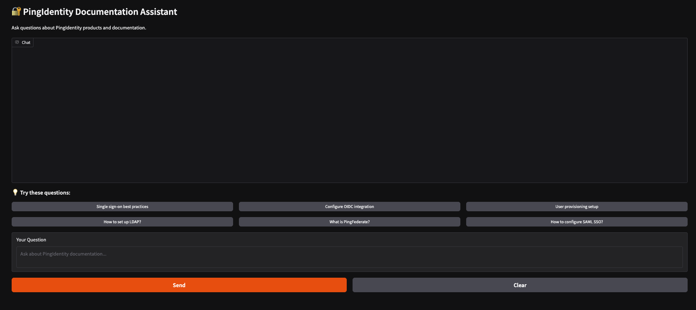

# Documentation Assistant

A RAG (Retrieval-Augmented Generation) based AI assistant for querying any documentation site using natural language.

Point it at any docs URL, ingest once, then query via web UI or terminal. The web UI title and system prompt are automatically branded from the target site name.

Uses **Claude via Amazon Bedrock** for LLM responses and **local sentence-transformers** for vector search.

## Screenshot



## How It Works

1. **Scrape** — BFS-crawls the target documentation site and extracts page content
2. **Index** — Chunks text into parent/child sections and embeds child chunks locally
3. **Query** — User question is embedded and matched against child chunks via similarity search
4. **Retrieve** — Full parent sections are returned as context (better accuracy than flat chunks)
5. **Answer** — Claude streams a response with source citations via Amazon Bedrock

## Architecture

```
┌─────────────────────────────────────────────────────────┐
│                    User Question                        │
│  "How do I configure SSO?"                             │
└────────────────────────┬────────────────────────────────┘
                         │
                         ▼
┌─────────────────────────────────────────────────────────┐
│              Parent-Child Retrieval (ChromaDB)          │
│                                                         │
│  Child chunks (300 chars) ──▶ semantic similarity       │
│  Parent sections (4000 chars) ◀── context for LLM      │
└────────────────────────┬────────────────────────────────┘
                         │
                         ▼
┌─────────────────────────────────────────────────────────┐
│         Claude via Amazon Bedrock (streaming)           │
│         LangChain ChatBedrockConverse → token-by-token  │
└────────────────────────┬────────────────────────────────┘
                         │
                         ▼
┌─────────────────────────────────────────────────────────┐
│    Answer with source URLs and documentation refs       │
└─────────────────────────────────────────────────────────┘
```

## Features

- **Generic** — works with any documentation site; set `DOCS_BASE_URL` and ingest
- **Auto-branding** — web UI title and system prompt derive from `SITE_NAME` (or auto-detected from URL)
- **Parent-child retrieval** — small chunks for precise matching, full sections for LLM context
- **Local embeddings** — sentence-transformers on CPU, no API calls or rate limits
- **Claude via Bedrock** — streaming responses via `ChatBedrockConverse` (~2s to first token)
- **Source citations** — documentation URLs shown with every response
- **Dynamic example questions** — "Try these questions" section populated from actual indexed page titles
- **Gradio web UI** — streaming interface with scroll-to-latest and input locking during generation
- **Terminal chat** — interactive CLI session via `python main.py chat`
- **Evaluation** — hit rate and RAGAS benchmarks via `python main.py evaluate`

## Technologies

| Category | Technology |
|----------|------------|
| **Language** | Python 3.10+ |
| **LLM** | Claude (Sonnet 4.6) via Amazon Bedrock |
| **Streaming** | LangChain `ChatBedrockConverse` |
| **Embeddings** | sentence-transformers (`all-MiniLM-L6-v2`) |
| **Vector Store** | ChromaDB |
| **Retrieval** | LangChain `ParentDocumentRetriever` |
| **Web UI** | Gradio |
| **CLI** | Typer + Rich |
| **Web Scraping** | BeautifulSoup + requests |

## Project Structure

```
docs-assistant/
├── main.py              # CLI entry point (ingest, chat, web, status, clear, evaluate)
├── requirements.txt     # Python dependencies
├── README.md            # Setup guide (installation, configuration, commands)
├── ARCHITECTURE.md      # This file — overview, design, structure
├── rag/
│   ├── config.py        # All configuration via environment variables
│   ├── scraper.py       # BFS web scraper
│   ├── processor.py     # Document chunking and preprocessing
│   ├── vector_store.py  # ChromaDB + ParentDocumentRetriever (with in-process cache)
│   ├── rag_chain.py     # RAG pipeline — retrieval, prompt building, LLM calls
│   └── web_ui.py        # Gradio web interface with streaming UX
├── eval_testset.json    # Evaluation test cases
└── chroma_db/           # Vector database (created by ingest)
    └── parent_store/    # Parent section store (LocalFileStore)
```

## Key Design Decisions

**Parent-child retrieval over flat chunking**
Child chunks (300 chars) are embedded for precise semantic matching. At query time, their parent sections (4000 chars) are returned as LLM context. This gives retrieval precision of small chunks with the coherent context of larger sections.

**LangChain ChatBedrockConverse for streaming**
`ChatBedrockConverse.stream()` yields tokens as they arrive from Bedrock, giving ~2s to first token in both the web UI and terminal chat.

**In-process module-level cache**
The embeddings model and retriever are loaded once on startup and cached for the process lifetime. Subsequent queries skip the ~10s load time.

**Dynamic example questions**
At startup, the web UI samples page titles from ChromaDB and surfaces them as clickable question prompts. Falls back to generic questions if the DB is empty.

## Documentation

See [README.md](README.md) for installation, configuration, CLI reference, Docker deployment, tuning, and troubleshooting.

## License

MIT
